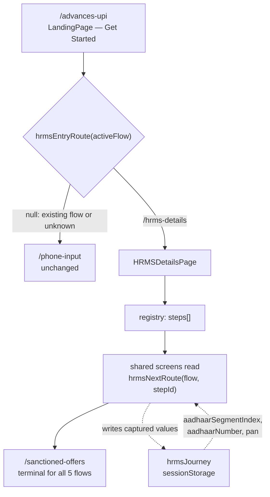
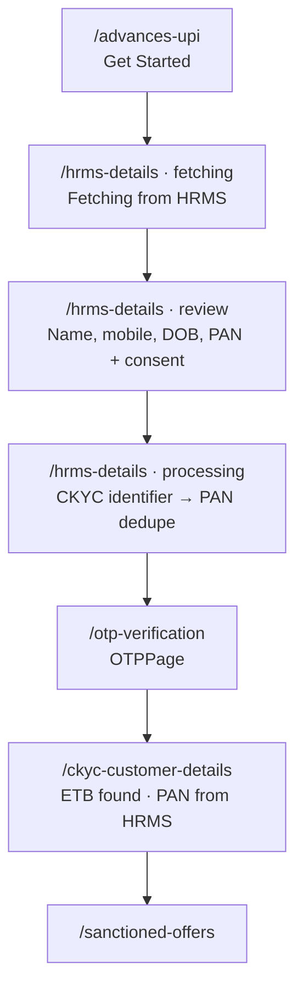
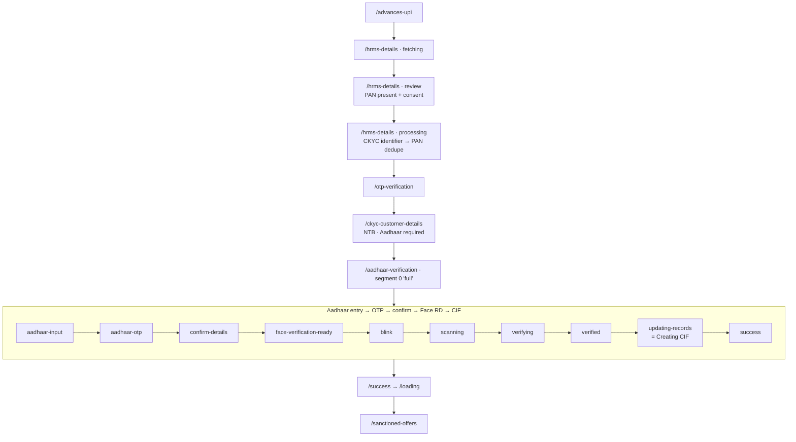
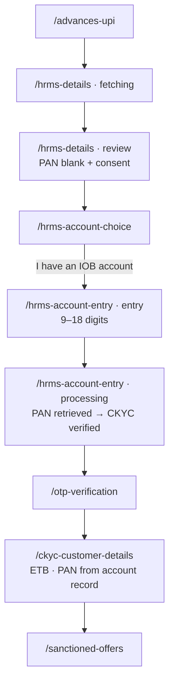
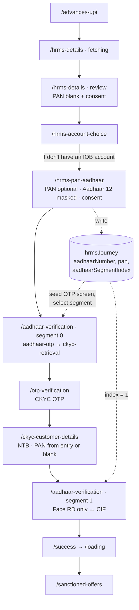
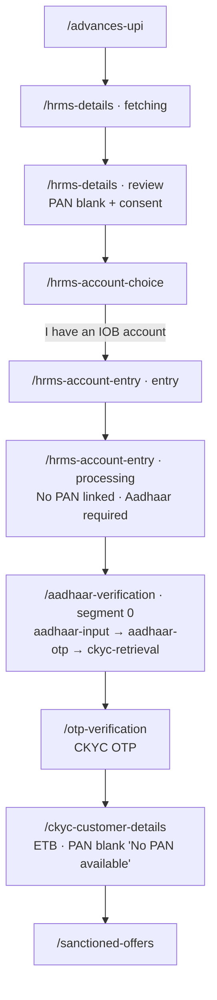

# Design Document

## Overview

This feature adds five HRMS-originated demo journeys to the Kalanjiyam salary-advance prototype. The five journeys start from the same "Get Started" control on `/advances-upi`, fetch a fixed dummy employee record, and then branch on two conditions: whether HRMS returned a PAN, and whether the customer is ETB or NTB.

The design is governed by three constraints that pull in opposite directions:

1. **Requirement 1 pins the eight existing journeys exactly.** No existing screen order, destination, Dev Preview label, route path or default flow value may change.
2. **Requirement 13 forbids duplicating screens.** The new journeys must reuse `OTPPage`, `CKYCCustomerDetailsPage`, `AadhaarVerificationPage`, `LoadingPage`, `SuccessSplashPage` and `SanctionedOffersPage`, and add exactly four new screen components.
3. **Requirement 13.8–13.10 needs `AadhaarVerificationPage` to run as a resumable, configurable subset of its internal steps** — flow 4 runs it twice, as two disjoint segments, without re-asking for the Aadhaar number and without a second Aadhaar OTP.

Today, flow branching is scattered. `CKYCConsentPage` holds a local `panRoutes` map, `AadhaarVerificationPage` computes `dest` inline in an effect, `EmployeeIDUploadPage` computes `dest` in three separate places, and `CKYCCustomerDetailsPage` holds a `flowConfigs` record. Each reads `localStorage.getItem('activeFlow')` independently. Adding five flows by extending each of those sites would multiply the scatter.

### Design strategy

Introduce a **flow-step registry** at `src/app/flows/hrmsFlows.ts` that declares each HRMS flow's ordered steps, per-step simulated processing, Aadhaar segments, and destinations as data. Shared screens then follow one uniform, strictly additive pattern:

```ts
// HRMS opt-in guard, placed BEFORE the existing branch. Existing logic untouched.
const flow = getActiveFlow();
const hrmsNext = hrmsNextRoute(flow, 'ckyc-details');
if (hrmsNext) { navigate(hrmsNext); return; }
// ── existing logic below, byte-for-byte unchanged ──
```

`hrmsNextRoute` returns `null` for every non-HRMS value, including unknown values, so an existing flow can never fall into an HRMS branch. This satisfies Requirement 1.2 structurally rather than by inspection: the only way an existing flow reaches new code is if `isHrmsFlow` returns a false positive, which is a single, testable pure predicate over a closed five-element set.

The registry is **not** retrofitted onto the eight existing flows. `CKYCConsentPage.panRoutes`, `AadhaarVerificationPage`'s `dest` map and `EmployeeIDUploadPage`'s `dest` map stay exactly as they are. The scatter is contained, not rewritten — rewriting it would put Requirement 1 at risk for no demo benefit.

### Key decisions and rationale

| Decision | Rationale |
| --- | --- |
| Registry is HRMS-only, additive; existing route maps untouched | Requirement 1 pins existing behaviour. A shared registry for all 13 flows would require re-deriving eight legacy paths and re-verifying them; the risk is not worth the tidiness. |
| Simulated processing steps live as *phases inside* the screen that owns them, not as new route components | Matches the existing convention (`CKYCConsentPage`, `CKYCCustomerDetailsPage`, `EmployeeIDUploadPage` all embed a `processing` phase) and keeps the new-component count at exactly four (Requirement 13.6). Requirements 6.5–6.6 confirm the intent: the account-retrieval step must keep the *same screen's* continue control disabled. |
| Aadhaar segment selection via a **journey-state step pointer** in `sessionStorage`, not route params or `location.state` | `location.state` is lost on reload and on `navigate(-1)`; a query param would need to be threaded through every intermediate screen (flow 4 passes through CKYC retrieval, OTP and CKYC details between segment A and segment B). A pointer in journey state survives all of that, needs no route changes, and matches the prototype's existing `localStorage` habit. |
| Journey state in `sessionStorage`, flow id stays in `localStorage` | `activeFlow` must remain in `localStorage` under the same key (Requirement 1.5). Per-run captured values belong to the run, so `sessionStorage` gives a clean slate in a new tab and makes Requirement 14.11 / 1.9 (discard on flow switch) a one-line reset. |
| `AadhaarVerificationPage`'s linear `setStep('x')` chain is refactored into a `sequence` array plus `goNext()` | The page's existing transitions are already strictly linear. Making the sequence data means the default sequence reproduces today's order exactly, and an HRMS segment is just a shorter array. No behavioural change for the eight existing flows. |
| `CKYCCustomerDetailsPage.flowConfigs` is looked up **first**, HRMS config **second** | Existing keys resolve before any new code runs, so Requirement 1.8 (no HRMS text on shared screens in existing flows) holds by construction: the HRMS-only fields are `undefined` for existing flows and their render blocks are omitted. |
| No new PBT-free "simulated backend" service; determinism comes from the registry | Requirement 14.5 says every simulated outcome derives from the Active_Flow value and nothing else. Encoding outcomes as literal fields on the flow definition makes that a type-level guarantee rather than a runtime convention. |

## Architecture

### Module layout

```
src/app/
  flows/
    hrmsFlows.ts        NEW  flow definitions, step tables, Aadhaar segments, resolvers
    hrmsJourney.ts      NEW  journey-state read/write/reset over sessionStorage
    hrmsContent.ts      NEW  bilingual strings for new screens + HRMS progress steps
  components/
    HRMSDetailsPage.tsx      NEW  fetch phase + review/consent phase + dedupe processing phase
    AccountChoicePage.tsx    NEW
    IOBAccountEntryPage.tsx  NEW  entry phase + account-retrieval processing phase
    PANAadhaarEntryPage.tsx  NEW
    LandingPage.tsx          EDIT one-line entry-point branch
    OTPPage.tsx              EDIT additive HRMS branch in handleVerify + error region
    CKYCCustomerDetailsPage.tsx  EDIT HRMS config fallback + dedupe banner + PAN source
    AadhaarVerificationPage.tsx  EDIT sequence/segment refactor + ckyc-retrieval step
    DevPreview.tsx           EDIT data-driven flow lookup + 5 appended entries
  routes.tsx                 EDIT 4 new route entries appended
```

### Control flow



Every HRMS flow terminates at `/sanctioned-offers`, from which the existing offer-selection and activation screens continue unchanged.

### Layering rules

- `flows/*` modules are pure: no React imports, no `navigate`, no JSX. They read `localStorage`/`sessionStorage` through two narrow accessors so they can be unit-tested with a stub storage.
- Components never hardcode an HRMS destination. They ask the registry for `(flowId, stepId) → route`.
- The registry never imports a component. Routes are string literals in one place, mirrored by `routes.tsx`.

## Components and Interfaces

### `src/app/flows/hrmsFlows.ts`

```ts
export const HRMS_FLOW_IDS = [
  'hrms-pan-etb',
  'hrms-pan-ntb',
  'hrms-nopan-etb',
  'hrms-nopan-ntb',
  'hrms-nopan-etb-nopan',
] as const;

export type HrmsFlowId = (typeof HRMS_FLOW_IDS)[number];

export const EXISTING_FLOW_IDS = [
  'ntb-no-ckyc', 'etb-no-ckyc', 'ntb-no-ckyc-id', 'etb-no-ckyc-id',
  'ntb-knows-ckyc', 'etb-knows-ckyc', 'ntb-knows-ckyc-id', 'etb-knows-ckyc-id',
] as const;

/** Journey milestones. Each one is a step whose completion asks the registry where to go. */
export type HrmsStepId =
  | 'hrms-fetch'          // phase of /hrms-details
  | 'hrms-details'        // review + consent phase of /hrms-details
  | 'ckyc-pan-dedupe'     // processing phase of /hrms-details (flows 1, 2)
  | 'account-choice'      // /hrms-account-choice
  | 'account-entry'       // entry phase of /hrms-account-entry
  | 'account-pan-lookup'  // processing phase of /hrms-account-entry (flows 3, 5)
  | 'pan-aadhaar-entry'   // /hrms-pan-aadhaar
  | 'aadhaar'             // /aadhaar-verification (one or more segments)
  | 'ckyc-otp'            // /otp-verification
  | 'ckyc-details'        // /ckyc-customer-details
  | 'cif-success'         // /success -> /loading
  | 'offers';             // /sanctioned-offers (terminal)

export interface ProcessingStep {
  id: string;
  labelEn: string;
  labelTa: string;
  durationMs: number;    // 1000–2500, except hrms-fetch which is 1500–4000
}

export interface HrmsStep {
  id: HrmsStepId;
  /** Route that renders this step. */
  route: string;
  /** In-component phase name, when this step is a phase of `route` rather than its own route. */
  phase?: 'fetching' | 'review' | 'processing' | 'entry';
  /** Simulated backend steps this phase renders, in order. */
  processing?: ProcessingStep[];
  /** Route to navigate to when this step completes. `null` marks the terminal step. */
  next: string | null;
}

/** Internal step names of AadhaarVerificationPage, reused verbatim. */
export type AadhaarStepId =
  | 'aadhaar-input' | 'aadhaar-otp' | 'confirm-details'
  | 'face-verification-ready' | 'blink' | 'scanning' | 'verifying' | 'verified'
  | 'ckyc-retrieval'        // NEW, HRMS-only
  | 'updating-records' | 'success';

export interface AadhaarSegment {
  id: string;
  /** Ordered subset of AadhaarVerificationPage's internal steps. Steps not listed are never rendered. */
  steps: AadhaarStepId[];
  /** Seed the Aadhaar number from journey state instead of asking for it. */
  seedAadhaarFromJourney: boolean;
  /** Relabel `updating-records` as CIF creation for this segment. */
  updatingRecordsAs?: 'records' | 'cif';
  /** Where to go when the last step of this segment finishes. */
  exitRoute: string;
  /** Processing steps rendered by the `ckyc-retrieval` step, when present. */
  processing?: ProcessingStep[];
}

export interface CkycDetailsConfig {
  /** Dedupe banner rendered on CKYCCustomerDetailsPage. HRMS flows only. */
  dedupeResult: 'etb' | 'ntb';
  /** Where the displayed PAN comes from. `'none'` renders a blank PAN with an explanatory label. */
  panSource: 'hrms' | 'account-record' | 'journey' | 'none';
  next: string;
  /** Post-review processing. Empty for every HRMS flow — dedupe already ran earlier. */
  steps: ProcessingStep[];
}

export interface HrmsFlowDefinition {
  id: HrmsFlowId;
  /** Dev Preview entry, 1–60 chars, unique. */
  labelEn: string;
  /** Dev Preview description, 1–200 chars, screen names in presentation order. */
  descriptionEn: string;
  entryRoute: '/hrms-details';
  hrmsPanPresent: boolean;
  dedupe: 'etb' | 'ntb';
  /** PAN held by the IOB account record. `null` = none (flow 5). `undefined` = flow never looks. */
  accountRecordPan?: string | null;
  steps: HrmsStep[];
  aadhaarSegments: AadhaarSegment[];
  ckycDetails: CkycDetailsConfig;
}

// ── Resolvers ──────────────────────────────────────────────────────────────

/** Reads localStorage['activeFlow']; returns '' when absent or storage is unavailable. */
export function getActiveFlow(): string;

/** True only for the five HRMS ids. Never true for an Existing_Flow or an unknown value. */
export function isHrmsFlow(flow: string): flow is HrmsFlowId;

export function getHrmsFlow(flow: string): HrmsFlowDefinition | null;

/** Entry route for the journey start control, or null when the caller must keep its own behaviour. */
export function hrmsEntryRoute(flow: string): string | null;

/** Destination after `from` completes, or null when `flow` is not an HRMS flow / has no such step. */
export function hrmsNextRoute(flow: string, from: HrmsStepId): string | null;

/** Processing steps for `from`, or [] when not applicable. */
export function hrmsProcessing(flow: string, from: HrmsStepId): ProcessingStep[];

/** Segment at `index`, or null when the index is past the end or the flow has no segments. */
export function getAadhaarSegment(flow: string, index: number): AadhaarSegment | null;

/** HRMS config for CKYCCustomerDetailsPage, or null for every non-HRMS flow. */
export function getCkycDetailsConfig(flow: string): CkycDetailsConfig | null;

/** Whether `flow` presents a given HRMS-only screen. Used for negative assertions in tests. */
export function hasStep(flow: string, step: HrmsStepId): boolean;
```

### `src/app/flows/hrmsJourney.ts`

```ts
export interface HrmsJourneyState {
  /** The flow this state belongs to. A mismatch with activeFlow forces a reset. */
  flow: HrmsFlowId;
  consentAccepted: boolean;
  accountChoice: 'has-account' | 'no-account' | null;
  iobAccountNumber: string;
  /** 12 digits, unmasked, captured on PAN_Aadhaar_Entry_Screen or AadhaarVerificationPage. */
  aadhaarNumber: string;
  /** '' when no PAN is available. */
  pan: string;
  panSource: 'hrms' | 'account-record' | 'user' | 'none';
  /** Index into the flow's aadhaarSegments. */
  aadhaarSegmentIndex: number;
}

const KEY = 'hrmsJourney';   // sessionStorage

/**
 * Returns the current journey state. Creates a fresh state seeded from the flow
 * definition when none exists, when JSON parsing fails, or when the stored
 * `flow` differs from the active flow (Requirement 1.9, 14.11).
 */
export function readJourney(flow: HrmsFlowId): HrmsJourneyState;

/** Shallow-merges a patch and persists. Returns the merged state. */
export function writeJourney(flow: HrmsFlowId, patch: Partial<HrmsJourneyState>): HrmsJourneyState;

/** Removes the stored state. Called by DevPreview on every flow-entry activation. */
export function resetJourney(): void;

/** Increments aadhaarSegmentIndex and returns the new index. */
export function advanceAadhaarSegment(flow: HrmsFlowId): number;

/** Resolves the PAN string to display, per the flow's CkycDetailsConfig.panSource. */
export function resolveDisplayPan(flow: HrmsFlowId): string;
```

`readJourney` is the single place where staleness is handled, so no caller needs to know about flow switching.

### New screen components

All four follow the house pattern: `TopBar` + `main` + `max-w-lg mx-auto px-4` + `StickyFooter` CTA, `motion/react` entrance animations, Tailwind hex colors, bilingual content object keyed by `useLanguage()`.

#### `HRMSDetailsPage` — `/hrms-details`

```ts
type Phase = 'fetching' | 'review' | 'processing';
```

- `fetching`: renders the HRMS fetch progress step (2500 ms) from `hrmsProcessing(flow, 'hrms-fetch')`. Auto-advances to `review`. A back press during this phase leaves the component without setting `review` (Requirement 3.8) — the phase timer is cleared on unmount.
- `review`: name, 10-digit mobile, DOB as `DD/MM/YYYY`, and PAN. PAN is the HRMS PAN for flows 1–2 and blank with a "Not available in your HRMS record" label for flows 3–5. All four values render as `<p>` text, never `<input>`, so they are structurally non-editable (Requirement 4.1). One consent checkbox, unselected on first render, gating the CTA.
- `processing`: for flows 1–2 only, renders `hrmsProcessing(flow, 'ckyc-pan-dedupe')` = CKYC identifier retrieval then PAN dedupe, then navigates to `hrmsNextRoute(flow, 'ckyc-pan-dedupe')` = `/otp-verification`. Flows 3–5 skip `processing` and navigate straight to `hrmsNextRoute(flow, 'hrms-details')` = `/hrms-account-choice`.

Which of the two continue destinations applies is decided by the registry, not by the component: the component calls `hrmsNextRoute(flow, 'hrms-details')` and only enters `processing` when the flow declares a `ckyc-pan-dedupe` step.

#### `AccountChoicePage` — `/hrms-account-choice`

Two `<button role="radio">` options inside a `role="radiogroup"`, at most one selected, each carrying a `Check` icon plus the word "Selected" as a non-color signal. Selection is persisted to `journey.accountChoice` on change, so returning from a later screen restores it and leaves the CTA enabled (Requirement 5.8). Destination: `has-account` → `/hrms-account-entry`, `no-account` → `/hrms-pan-aadhaar`. Both are read from the flow's step table rather than hardcoded, via a small `branch` field on the `account-choice` step:

```ts
{ id: 'account-choice', route: '/hrms-account-choice', next: '/hrms-account-entry',
  altNext: '/hrms-pan-aadhaar' }   // altNext = "I don't have an IOB account"
```

#### `IOBAccountEntryPage` — `/hrms-account-entry`

```ts
type Phase = 'entry' | 'processing';
```

- `entry`: one labelled numeric input. `onChange` strips non-digits and slices to 18 (Requirement 6.1, 6.3). Helper text always visible stating 9–18 digits. CTA enabled at ≥9 digits; clicking while shorter shows a `role="alert"` error linked by `aria-describedby` and starts no retrieval (Requirement 6.4).
- `processing`: renders `hrmsProcessing(flow, 'account-pan-lookup')`. The input is `readOnly` and the CTA disabled for the duration (Requirement 6.6). Outcome text is deterministic from `flow.accountRecordPan`:
  - flow 3 (`accountRecordPan` = `'ABCPK1234F'`): "PAN found in your account record" → `next` = `/otp-verification`, and the PAN is written to journey state with `panSource: 'account-record'`.
  - flow 5 (`accountRecordPan` = `null`): "No PAN is linked to this account. Aadhaar verification is required." → `next` = `/aadhaar-verification`, `panSource: 'none'`.

  Both outcomes render with a `CheckCircle` / `Info` icon and text, not color alone, and auto-advance without input.

#### `PANAadhaarEntryPage` — `/hrms-pan-aadhaar`

- PAN field: optional marker in the label, `maxLength=10`, uppercased on change, validated on blur against `/^[A-Z]{5}\d{4}[A-Z]$/`. Invalid non-empty PAN shows a `role="alert"` error and keeps the CTA disabled; entered characters are retained.
- Aadhaar field: reuses the masking technique already in `AadhaarVerificationPage` (transparent input + overlay, per-digit mask timer, 500 ms). Non-digits and digits past the 12th are dropped in `onChange`.
- One Aadhaar consent checkbox with the UIDAI authorisation text.
- CTA enabled only when Aadhaar length is 12 **and** consent is selected **and** PAN is empty or well-formed.
- On continue: writes `aadhaarNumber`, `pan`, `panSource: pan ? 'user' : 'none'`, sets `aadhaarSegmentIndex = 0`, navigates to `hrmsNextRoute(flow, 'pan-aadhaar-entry')` = `/aadhaar-verification`.

### Edits to existing components

#### `LandingPage` — entry point

The salary-advance start control is the `Get Started` CTA in `LandingPage` (`onClick={() => navigate('/phone-input')}`). `HomePage`'s "Advances on UPI" card and the four advance-type cards all navigate to `/advances-upi` and are unchanged.

```ts
onClick={() => navigate(hrmsEntryRoute(getActiveFlow()) ?? '/phone-input')}
```

`hrmsEntryRoute` returns `null` for the eight existing flows, for an absent value and for any unrecognised value, which is exactly Requirements 3.2 and 3.6.

#### `OTPPage`

Today: `handleVerify` requires `otp.join('') === '123456'` and navigates to `/ckyc-consent`; the CTA is disabled until six digits are present.

Additive change — an HRMS branch placed first:

```ts
const flow = getActiveFlow();
const hrmsNext = hrmsNextRoute(flow, 'ckyc-otp');   // '/ckyc-customer-details' for all 5 flows

const handleVerify = () => {
  if (hrmsNext) {
    if (otp.join('').length !== 6) { setOtpError(true); return; }   // role="alert"
    setVerifying(true);
    setTimeout(() => navigate(hrmsNext), 1200);
    return;
  }
  // ── existing behaviour, unchanged ──
  if (otp.join('') === '123456' && !verifying) { ... }
};
```

In HRMS flows the CTA is rendered enabled (so the "activate with fewer than six digits" path in Requirements 8.8 / 9.4 / 10.8 / 11.6 / 12.7 is reachable) and any six digits are accepted. In existing flows the `disabled` prop, the `'123456'` comparison and the `/ckyc-consent` destination are all untouched.

`hrmsNextRoute(flow, 'ckyc-otp')` is `/ckyc-customer-details` for all five flows, so this branch needs no per-flow logic.

#### `CKYCCustomerDetailsPage`

```ts
const hrmsConfig = getCkycDetailsConfig(flow);         // null for existing flows
const config = flowConfigs[flow] ?? hrmsConfig ?? flowConfigs['ntb-no-ckyc'];
```

Existing keys resolve on the first lookup, so the eight existing flows never touch new code. Three additive render concerns, each guarded on an HRMS-only field being present:

- **Dedupe banner.** `config.dedupeResult` is `undefined` for existing flows, so the banner block is omitted entirely (Requirement 1.8). For HRMS flows it renders visible text — "Existing bank customer record found" / "No existing bank customer record found. Aadhaar verification is required." — with a `CheckCircle` or `Info` icon, no hover or focus needed.
- **PAN row.** `resolveDisplayPan(flow)` supplies the value per `panSource`. For `'none'` (flow 5) the row shows an empty value with the label "No PAN available".
- **Destination.** `config.next` already drives `handleContinue`; the HRMS configs supply `/sanctioned-offers` or `/aadhaar-verification` and an empty `steps` array, so no processing phase runs.

#### `AadhaarVerificationPage` — the segment mechanism

The page's transitions are already a straight line: `aadhaar-input → aadhaar-otp → confirm-details → face-verification-ready → blink → scanning → verifying → verified → updating-records → success → navigate(dest)`. The refactor turns that line into data.

```ts
const DEFAULT_SEQUENCE: AadhaarStepId[] = [
  'aadhaar-input', 'aadhaar-otp', 'confirm-details',
  'face-verification-ready', 'blink', 'scanning', 'verifying', 'verified',
  'updating-records', 'success',
];

const flow = getActiveFlow();
const journey = isHrmsFlow(flow) ? readJourney(flow) : null;
const segment = journey ? getAadhaarSegment(flow, journey.aadhaarSegmentIndex) : null;

const sequence = segment?.steps ?? DEFAULT_SEQUENCE;
const [step, setStep] = useState<AadhaarStepId>(sequence[0]);

/** Advance one position in the active sequence; exit when the sequence is exhausted. */
const goNext = () => {
  const i = sequence.indexOf(step);
  const nextStep = sequence[i + 1];
  if (nextStep) { setStep(nextStep); return; }
  exitSegment();
};

const exitSegment = () => {
  if (segment) {
    advanceAadhaarSegment(flow as HrmsFlowId);
    navigate(segment.exitRoute);
    return;
  }
  // ── existing destination map, unchanged ──
  const dest = (flow === 'ntb-no-ckyc-id' || flow === 'ntb-knows-ckyc-id')
    ? '/employee-id-upload' : '/loading';
  navigate(dest);
};
```

Every `setStep('<literal>')` that represents forward progress becomes `goNext()`. Backward jumps stay literal: the `blink`/`scanning` back buttons keep `setStep('face-verification-ready')`, and "Not Me" keeps `navigate(-1)`.

For the eight existing flows `segment` is `null`, `sequence` is `DEFAULT_SEQUENCE`, and `goNext()` reproduces today's order exactly, ending in the same two-destination map. That is the whole of Requirement 1's exposure on this screen.

Two additions:

- **New internal step `ckyc-retrieval`.** Renders the "Retrieving your CKYC record using your Aadhaar number" progress step from `segment.processing`, then `goNext()`. It appears in no default sequence, so existing flows never render it.
- **Seeded Aadhaar.** When `segment.seedAadhaarFromJourney` is true, `aadhaarDigits` initialises from `journey.aadhaarNumber` and the `aadhaar-input` step is absent from the sequence, so no re-entry is requested. The `confirm-details` and OTP screens derive their masked display from the seeded value.
- **`updating-records` relabel.** `segment.updatingRecordsAs === 'cif'` swaps the heading to "Creating your customer record (CIF)". Absent for existing flows.

Segment resumption in flow 4 works because `aadhaarSegmentIndex` is incremented on exit, not on entry. Segment A exits with the pointer at 1; the journey then passes through CKYC retrieval, OTP and CKYC details; when `/aadhaar-verification` is entered again the pointer reads 1 and segment B (`face-verification-ready` first) renders within one paint (Requirement 13.10).

#### `DevPreview` — data-driven flow lookup

The eleven-branch `if (path === '/__flow-x')` chain collapses to a lookup, preserving both legacy keys (`ckyc-only`, `combined`) that exist in `handleNavigate` but not in `routes`:

```ts
const FLOW_ENTRY_PATHS: Record<string, string> = {
  '/__flow-ckyc-only': 'ckyc-only',
  '/__flow-combined': 'combined',
  '/__flow-ntb-no-ckyc': 'ntb-no-ckyc',
  '/__flow-etb-no-ckyc': 'etb-no-ckyc',
  '/__flow-ntb-no-ckyc-id': 'ntb-no-ckyc-id',
  '/__flow-etb-no-ckyc-id': 'etb-no-ckyc-id',
  '/__flow-ntb-knows-ckyc': 'ntb-knows-ckyc',
  '/__flow-etb-knows-ckyc': 'etb-knows-ckyc',
  '/__flow-ntb-knows-ckyc-id': 'ntb-knows-ckyc-id',
  '/__flow-etb-knows-ckyc-id': 'etb-knows-ckyc-id',
  ...Object.fromEntries(HRMS_FLOW_IDS.map(id => [`/__flow-${id}`, id])),
};

const handleNavigate = (path: string) => {
  const flowId = FLOW_ENTRY_PATHS[path];
  if (flowId) {
    try {
      localStorage.setItem('activeFlow', flowId);
      resetJourney();
    } catch {
      setFlowError(true);   // role="alert"; keep panel open, no navigation
      return;
    }
    navigate('/');
    setIsOpen(false);
    return;
  }
  // ── existing per-screen state-seeding branches, unchanged ──
};
```

The five HRMS entries are appended to the `routes` array immediately after `/__flow-etb-knows-ckyc-id` and before `/` (Dashboard), in the order given by `HRMS_FLOW_IDS`. Existing entry names, descriptions and order are untouched. Each `motion.button` gains `focus-visible:outline-2 focus-visible:outline-offset-2 focus-visible:outline-[#315C9D]`.

Dev Preview entries:

| Path | Name | Description |
| --- | --- | --- |
| `/__flow-hrms-pan-etb` | ▶ HRMS PAN Present, ETB | HRMS fetch → HRMS details → CKYC ID + PAN dedupe → OTP → CKYC details (ETB) → Offers |
| `/__flow-hrms-pan-ntb` | ▶ HRMS PAN Present, NTB | HRMS fetch → HRMS details → CKYC ID + PAN dedupe → OTP → CKYC details (NTB) → Aadhaar + Face → CIF → Offers |
| `/__flow-hrms-nopan-etb` | ▶ HRMS No PAN, ETB (account has PAN) | HRMS fetch → HRMS details → Account choice → Account number → PAN found + CKYC → OTP → CKYC details → Offers |
| `/__flow-hrms-nopan-ntb` | ▶ HRMS No PAN, NTB (no IOB account) | HRMS fetch → HRMS details → Account choice → PAN + Aadhaar → Aadhaar OTP → CKYC by Aadhaar → OTP → CKYC details → Face → CIF → Offers |
| `/__flow-hrms-nopan-etb-nopan` | ▶ HRMS No PAN, ETB, account holds no PAN | HRMS fetch → HRMS details → Account choice → Account number → No PAN found → Aadhaar + OTP → CKYC by Aadhaar → OTP → CKYC details → Offers |

## Data Models

### New route paths

| Route | Component | Notes |
| --- | --- | --- |
| `/hrms-details` | `HRMSDetailsPage` | Entry route for all five flows; owns fetch, review and dedupe phases |
| `/hrms-account-choice` | `AccountChoicePage` | Flows 3, 4, 5 |
| `/hrms-account-entry` | `IOBAccountEntryPage` | Flows 3, 5; owns account-retrieval phase |
| `/hrms-pan-aadhaar` | `PANAadhaarEntryPage` | Flow 4 |

Appended to the `children` array in `routes.tsx` after `credit-line-dashboard`. Every existing path keeps its component (Requirement 1.6).

### Fixed dummy data

```ts
export const HRMS_EMPLOYEE = {
  name: 'Aravind Kumar S.',
  mobile: '9876543210',
  dob: '12/03/1992',
  pan: 'ABCPK1234F',        // used only when hrmsPanPresent
};

export const ACCOUNT_RECORD_PAN = 'ABCPK1234F';   // flow 3 only
```

`CKYCCustomerDetailsPage`'s existing `CKYC_DATA` constant is reused as-is for the CKYC record; only the PAN row is overridden by `resolveDisplayPan`.

### Simulated processing steps

All durations sit inside the required windows: HRMS fetch 2500 ms (1500–4000), every other step 1200–2200 ms (1000–2500).

| Step id | English label | Duration |
| --- | --- | --- |
| `hrms-fetch` | Fetching your employee details from HRMS… | 2500 |
| `ckyc-id` | Retrieving your CKYC identifier… | 1800 |
| `pan-dedupe` | Checking your PAN against bank records… | 2000 |
| `account-pan` | Retrieving the PAN from your account record… | 1800 |
| `ckyc-verify` | Verifying your CKYC record… | 2000 |
| `account-pan-absent` | Checking your account record for a PAN… | 1800 |
| `ckyc-by-aadhaar` | Retrieving your CKYC record using your Aadhaar number… | 2000 |
| `cif-create` | Creating your customer record (CIF)… | 2000 |

Each carries a Tamil counterpart in the same object, and each renders a `Loader2` spinner while active and a `CheckCircle` plus green text when complete, so state is signalled by icon and text as well as color.

### Per-flow step tables

#### Flow 1 — `hrms-pan-etb`

| # | Step id | Route | Phase | Simulated steps | Next |
| --- | --- | --- | --- | --- | --- |
| 1 | `hrms-fetch` | `/hrms-details` | `fetching` | `hrms-fetch` | (phase) `review` |
| 2 | `hrms-details` | `/hrms-details` | `review` | — | (phase) `processing` |
| 3 | `ckyc-pan-dedupe` | `/hrms-details` | `processing` | `ckyc-id`, `pan-dedupe` | `/otp-verification` |
| 4 | `ckyc-otp` | `/otp-verification` | — | — | `/ckyc-customer-details` |
| 5 | `ckyc-details` | `/ckyc-customer-details` | — | — | `/sanctioned-offers` |
| 6 | `offers` | `/sanctioned-offers` | — | — | `null` (terminal) |

`ckycDetails`: `{ dedupeResult: 'etb', panSource: 'hrms', next: '/sanctioned-offers', steps: [] }`. `aadhaarSegments: []`.

#### Flow 2 — `hrms-pan-ntb`

| # | Step id | Route | Phase | Simulated steps | Next |
| --- | --- | --- | --- | --- | --- |
| 1 | `hrms-fetch` | `/hrms-details` | `fetching` | `hrms-fetch` | (phase) `review` |
| 2 | `hrms-details` | `/hrms-details` | `review` | — | (phase) `processing` |
| 3 | `ckyc-pan-dedupe` | `/hrms-details` | `processing` | `ckyc-id`, `pan-dedupe` | `/otp-verification` |
| 4 | `ckyc-otp` | `/otp-verification` | — | — | `/ckyc-customer-details` |
| 5 | `ckyc-details` | `/ckyc-customer-details` | — | — | `/aadhaar-verification` |
| 6 | `aadhaar` | `/aadhaar-verification` | segment 0 | `cif-create` (at `updating-records`) | `/success` |
| 7 | `cif-success` | `/success` → `/loading` | — | existing `LoadingPage` steps | `/sanctioned-offers` |
| 8 | `offers` | `/sanctioned-offers` | — | — | `null` |

`ckycDetails`: `{ dedupeResult: 'ntb', panSource: 'hrms', next: '/aadhaar-verification', steps: [] }`.

`aadhaarSegments`:

```ts
[{
  id: 'full',
  steps: ['aadhaar-input', 'aadhaar-otp', 'confirm-details',
          'face-verification-ready', 'blink', 'scanning', 'verifying', 'verified',
          'updating-records', 'success'],
  seedAadhaarFromJourney: false,
  updatingRecordsAs: 'cif',
  exitRoute: '/success',
}]
```

`/success` (`SuccessSplashPage`, 1500 ms) → `/loading` (`LoadingPage`) → `/sanctioned-offers`, all existing and unchanged, which is the CIF_Success_Screen pair named in the glossary.

#### Flow 3 — `hrms-nopan-etb`

| # | Step id | Route | Phase | Simulated steps | Next |
| --- | --- | --- | --- | --- | --- |
| 1 | `hrms-fetch` | `/hrms-details` | `fetching` | `hrms-fetch` | (phase) `review` |
| 2 | `hrms-details` | `/hrms-details` | `review` (blank PAN) | — | `/hrms-account-choice` |
| 3 | `account-choice` | `/hrms-account-choice` | — | — | `/hrms-account-entry` (has) · `/hrms-pan-aadhaar` (has not) |
| 4 | `account-entry` | `/hrms-account-entry` | `entry` | — | (phase) `processing` |
| 5 | `account-pan-lookup` | `/hrms-account-entry` | `processing` | `account-pan`, `ckyc-verify` | `/otp-verification` |
| 6 | `ckyc-otp` | `/otp-verification` | — | — | `/ckyc-customer-details` |
| 7 | `ckyc-details` | `/ckyc-customer-details` | — | — | `/sanctioned-offers` |
| 8 | `offers` | `/sanctioned-offers` | — | — | `null` |

`accountRecordPan: 'ABCPK1234F'`. `ckycDetails`: `{ dedupeResult: 'etb', panSource: 'account-record', next: '/sanctioned-offers', steps: [] }`. `aadhaarSegments: []`.

#### Flow 4 — `hrms-nopan-ntb`

| # | Step id | Route | Phase | Simulated steps | Next |
| --- | --- | --- | --- | --- | --- |
| 1 | `hrms-fetch` | `/hrms-details` | `fetching` | `hrms-fetch` | (phase) `review` |
| 2 | `hrms-details` | `/hrms-details` | `review` (blank PAN) | — | `/hrms-account-choice` |
| 3 | `account-choice` | `/hrms-account-choice` | — | — | `/hrms-pan-aadhaar` ("I don't have") |
| 4 | `pan-aadhaar-entry` | `/hrms-pan-aadhaar` | — | — | `/aadhaar-verification` |
| 5 | `aadhaar` | `/aadhaar-verification` | **segment 0** | `ckyc-by-aadhaar` | `/otp-verification` |
| 6 | `ckyc-otp` | `/otp-verification` | — | — | `/ckyc-customer-details` |
| 7 | `ckyc-details` | `/ckyc-customer-details` | — | — | `/aadhaar-verification` |
| 8 | `aadhaar` | `/aadhaar-verification` | **segment 1** | `cif-create` | `/success` |
| 9 | `cif-success` | `/success` → `/loading` | — | existing | `/sanctioned-offers` |
| 10 | `offers` | `/sanctioned-offers` | — | — | `null` |

`ckycDetails`: `{ dedupeResult: 'ntb', panSource: 'journey', next: '/aadhaar-verification', steps: [] }` — `resolveDisplayPan` returns the user-entered PAN, or `''` with a "No PAN provided" label when the optional field was left blank.

`aadhaarSegments`:

```ts
[
  { id: 'otp-then-ckyc',
    steps: ['aadhaar-otp', 'ckyc-retrieval'],
    seedAadhaarFromJourney: true,
    processing: [ckycByAadhaar],
    exitRoute: '/otp-verification' },

  { id: 'face-only',
    steps: ['face-verification-ready', 'blink', 'scanning', 'verifying', 'verified',
            'updating-records', 'success'],
    seedAadhaarFromJourney: true,
    updatingRecordsAs: 'cif',
    exitRoute: '/success' },
]
```

Segment 0 omits `aadhaar-input` (the number was captured on `/hrms-pan-aadhaar`) and omits `confirm-details`. Segment 1 omits `aadhaar-input` and `aadhaar-otp`, so no second Aadhaar OTP is ever shown (Requirement 13.9, 13.10). No `IOB_Account_Entry_Screen` appears anywhere in this flow.

#### Flow 5 — `hrms-nopan-etb-nopan`

| # | Step id | Route | Phase | Simulated steps | Next |
| --- | --- | --- | --- | --- | --- |
| 1 | `hrms-fetch` | `/hrms-details` | `fetching` | `hrms-fetch` | (phase) `review` |
| 2 | `hrms-details` | `/hrms-details` | `review` (blank PAN) | — | `/hrms-account-choice` |
| 3 | `account-choice` | `/hrms-account-choice` | — | — | `/hrms-account-entry` |
| 4 | `account-entry` | `/hrms-account-entry` | `entry` | — | (phase) `processing` |
| 5 | `account-pan-lookup` | `/hrms-account-entry` | `processing` | `account-pan-absent` | `/aadhaar-verification` |
| 6 | `aadhaar` | `/aadhaar-verification` | segment 0 | `ckyc-by-aadhaar` | `/otp-verification` |
| 7 | `ckyc-otp` | `/otp-verification` | — | — | `/ckyc-customer-details` |
| 8 | `ckyc-details` | `/ckyc-customer-details` | — | — | `/sanctioned-offers` |
| 9 | `offers` | `/sanctioned-offers` | — | — | `null` |

`accountRecordPan: null`. `ckycDetails`: `{ dedupeResult: 'etb', panSource: 'none', next: '/sanctioned-offers', steps: [] }`.

`aadhaarSegments`:

```ts
[{
  id: 'entry-otp-ckyc',
  steps: ['aadhaar-input', 'aadhaar-otp', 'ckyc-retrieval'],
  seedAadhaarFromJourney: false,
  processing: [ckycByAadhaar],
  exitRoute: '/otp-verification',
}]
```

No `face-verification-ready`, `blink`, `scanning`, `verifying`, `verified` or `updating-records` step, so no Face RD and no CIF creation (Requirement 12.10).

### Flow diagrams

#### Flow 1 — `hrms-pan-etb`



#### Flow 2 — `hrms-pan-ntb`



#### Flow 3 — `hrms-nopan-etb`



#### Flow 4 — `hrms-nopan-ntb`



#### Flow 5 — `hrms-nopan-etb-nopan`



### Bilingual content model

New strings live in `src/app/flows/hrmsContent.ts` so the four new screens and the shared progress-step labels draw from one source:

```ts
export const hrmsContent = {
  English: { /* every heading, label, option, helper, consent, error string */ },
  Tamil:   { /* same keys */ },
} satisfies Record<Language, HrmsStrings>;

/** Falls back to the English value when a Tamil value is empty or missing. */
export function tr(lang: Language, key: keyof HrmsStrings): string;
```

`HrmsStrings` is declared once, so `satisfies` makes a missing Tamil key a compile error; `tr` covers the empty-string case at runtime (Requirement 15.6). Screens call `useLanguage()` exactly as the existing screens do, so a language change re-renders in place without navigation and without clearing local component state (Requirement 15.7).

### Accessibility model for the new screens

Applied uniformly, per the workspace desktop-accessibility steering:

- One `<h1>` per screen; sub-headings step down to `<h2>`. Primary content wrapped in `<main>`; `TopBar` supplies the `<header>`.
- Every action is a `<button>`; the only `<a>` is the existing tap-to-call pattern where reused.
- `focus-visible:outline-2 focus-visible:outline-offset-2 focus-visible:outline-[#315C9D]` on every interactive element.
- Primary CTAs `h-12` (48 px ≥ 44); icon-only controls at least `w-6 h-6` with padding to 24 px, and `aria-label`.
- Inputs have visible `<label>` elements; errors render in a `<p role="alert">` referenced by the input's `aria-describedby`.
- Selected, error and success states each carry an icon plus text alongside any color change.
- `max-w-lg mx-auto px-4` with fluid children, so 320 px and 400 % zoom reflow without horizontal scroll.
- Entrance animations gated on a `useReducedMotion()` check from `motion/react`; when reduced motion is requested, `initial`/`animate` collapse to the final state.

## Correctness Properties

*A property is a characteristic or behavior that should hold true across all valid executions of a system — essentially, a formal statement about what the system should do. Properties serve as the bridge between human-readable specifications and machine-verifiable correctness guarantees.*

These properties are worth writing because the flow registry, the journey-state module and the input-validation predicates are pure functions over a closed, enumerable domain (13 flow ids, 12 step ids, arbitrary strings for the input validators). The routing and screen-sequence guarantees that Requirement 1 pins are exactly the kind of universally quantified statement PBT is good at: "for **every** existing flow id and **every** step id, no HRMS route is ever produced." The React screens themselves are covered by example-based and component tests instead (see Testing Strategy).

### Property 1: HRMS flow recognition is exact

*For any* string, `isHrmsFlow` returns true if and only if that string is one of the five HRMS flow ids, and in particular returns false for every one of the eight Existing_Flow ids, for the empty string and for any other arbitrary string.

**Validates: Requirements 1.7, 3.6**

### Property 2: Existing flows never resolve to HRMS routing

*For any* Existing_Flow id or arbitrary non-HRMS string, and *for any* `HrmsStepId`, `hrmsEntryRoute` returns `null`, `hrmsNextRoute` returns `null`, `hrmsProcessing` returns an empty array, `getAadhaarSegment` returns `null` for every index, and `getCkycDetailsConfig` returns `null`.

**Validates: Requirements 1.1, 1.2, 1.7, 3.2, 3.6**

### Property 3: Every HRMS flow's step chain is a connected walk ending at the terminal screen

*For any* HRMS flow id, following `next` from the flow's first step visits each declared step exactly once, each visited step's `route` equals the route declared for that step id in the flow's step table, every non-terminal `next` equals the `route` of the following step or of a documented intermediate route, and the walk terminates at `/sanctioned-offers` with `next === null`.

**Validates: Requirements 4.6, 4.8, 5.3, 5.4, 6.6, 6.7, 6.8, 7.9, 8.1, 8.5, 8.6, 9.1, 9.6, 9.11, 10.1, 10.6, 10.7, 11.1, 11.8, 11.12, 12.1, 12.2, 12.9, 12.11, 13.1, 13.3, 13.4, 13.5**

### Property 4: Screen exclusions declared per flow hold across the whole step chain

*For any* HRMS flow id and *for any* HRMS-only step id that the flow's requirement text excludes, no step in that flow's step chain and no Aadhaar segment references the route or internal step corresponding to that exclusion.

**Validates: Requirements 5.9, 8.6, 10.10, 11.1, 12.10**

### Property 5: Aadhaar segments partition the flow's Aadhaar steps in order

*For any* HRMS flow id, concatenating the `steps` arrays of that flow's `aadhaarSegments` in index order yields a sequence that contains no duplicate step, contains at most one `aadhaar-input`, contains at most one `aadhaar-otp`, and is a subsequence of the canonical `DEFAULT_SEQUENCE` extended with `ckyc-retrieval`.

**Validates: Requirements 13.8, 13.9, 13.10**

### Property 6: Segment traversal exits exactly once at the declared route

*For any* HRMS flow id and *for any* segment index within range, repeatedly applying the sequence-advance function from that segment's first step visits every step of the segment in the declared order, renders no step outside the segment, and exits at that segment's `exitRoute` after exactly `steps.length` advances.

**Validates: Requirements 13.8, 13.10, 9.7, 11.1, 12.1**

### Property 7: The default Aadhaar sequence is unchanged

*For any* Existing_Flow id, the sequence used by `AadhaarVerificationPage` equals `DEFAULT_SEQUENCE`, advancing from any position in it yields the position immediately after, and exhausting it produces `/employee-id-upload` for `ntb-no-ckyc-id` and `ntb-knows-ckyc-id` and `/loading` for every other Existing_Flow id.

**Validates: Requirements 1.1, 1.2**

### Property 8: Journey state round-trips through storage

*For any* HRMS flow id and *for any* journey-state value, writing that state and reading it back yields an equal state, and reading a state written under a different flow id yields a freshly initialised state for the current flow rather than the stored one.

**Validates: Requirements 1.9, 6.9, 7.9, 9.6, 13.10, 14.11**

### Property 9: Aadhaar and PAN survive segment boundaries

*For any* 12-digit Aadhaar number and *for any* PAN value that is either empty or well-formed, writing them at the PAN_Aadhaar_Entry step and then advancing through every segment of `hrms-nopan-ntb` leaves both values unchanged and leaves `seedAadhaarFromJourney` true for every segment that follows the capture.

**Validates: Requirements 7.9, 11.7, 13.9, 13.10**

### Property 10: Account-number input accepts only 9-to-18-digit strings

*For any* string, the account-number sanitiser returns a digit-only string of at most 18 characters whose digits are the first 18 digits of the input in order, and the continue predicate is true if and only if that sanitised value has length between 9 and 18 inclusive.

**Validates: Requirements 6.1, 6.2, 6.3, 6.4**

### Property 11: Aadhaar input accepts only the first twelve digits

*For any* string, the Aadhaar sanitiser returns a digit-only string of at most 12 characters equal to the first 12 digits of the input in order, and appending a non-digit character or a thirteenth digit to an already-valid value leaves the sanitised value unchanged.

**Validates: Requirements 7.5, 7.8, 12.3, 12.4**

### Property 12: PAN validation matches the declared format and gates the CTA

*For any* string, the PAN validator accepts it if and only if it is empty or matches five uppercase letters followed by four digits followed by one uppercase letter, and the PAN_Aadhaar continue predicate is true if and only if the PAN is accepted, the Aadhaar value has exactly 12 digits, and the Aadhaar consent flag is true.

**Validates: Requirements 7.1, 7.2, 7.3, 7.4, 7.7**

### Property 13: Simulated outcomes derive from the flow id alone and are deterministic

*For any* HRMS flow id, resolving the dedupe result, the account-record PAN, the displayed PAN source and the full step chain any number of times returns equal values on every call, and two flows with the same id always produce the same results regardless of any journey-state values other than the user-entered PAN and Aadhaar.

**Validates: Requirements 3.7, 6.7, 6.8, 14.1, 14.2, 14.3, 14.4, 14.5, 14.8, 14.9, 12.5**

### Property 14: Every simulated step duration is inside its window

*For any* HRMS flow id and *for any* processing step declared anywhere in that flow, the step's `durationMs` lies between 1000 and 2500 inclusive, except the `hrms-fetch` step, whose duration lies between 1500 and 4000 inclusive.

**Validates: Requirements 3.5, 6.5, 8.2, 9.2, 9.8, 10.2, 11.3, 11.9, 14.6**

### Property 15: Every new visible string has both languages

*For any* key in the new-screen content model and *for any* Language value, `tr` returns a non-empty string, and when the Tamil value is empty or absent the returned value equals the English value.

**Validates: Requirements 15.1, 15.4, 15.6**

### Property 16: Every simulated step carries both language labels

*For any* HRMS flow id and *for any* processing step declared in that flow, both `labelEn` and `labelTa` are non-empty.

**Validates: Requirements 15.1, 15.4**

### Property 17: Dev Preview entries cover the five flows and preserve the eight

*For any* HRMS flow id, the Dev Preview route list contains exactly one entry whose path is `/__flow-<id>`, all five such entries appear consecutively at positions 9 through 13 in the declared order, every entry name is unique across the whole list and 1–60 characters long, every description is 1–200 characters long, and the first eight entries' paths, names and descriptions equal the pre-feature values.

**Validates: Requirements 1.3, 1.4, 2.1, 2.2, 2.3, 2.5**

### Property 18: Activating a flow entry sets exactly that flow and clears prior journey state

*For any* flow-entry path in the Dev Preview lookup table, activating it stores the corresponding flow id as `activeFlow`, removes any stored journey state, and leaves every other storage key unchanged; and *for any* storage failure during that write, the previously stored `activeFlow` value is unchanged and no journey state is written.

**Validates: Requirements 2.4, 2.7, 14.11, 1.9**

### Property 19: Flow-id normalisation on startup

*For any* stored `activeFlow` value, startup leaves the value unchanged when it is an Existing_Flow id or an HRMS flow id, and stores `ntb-no-ckyc` when the key is absent.

**Validates: Requirements 1.5**

### Property 20: The OTP destination is uniform across HRMS flows and untouched otherwise

*For any* HRMS flow id, `hrmsNextRoute(flow, 'ckyc-otp')` equals `/ckyc-customer-details`; and *for any* non-HRMS value it is `null`, so the existing `/ckyc-consent` destination remains the only reachable one.

**Validates: Requirements 8.3, 9.3, 10.4, 11.5, 12.6, 13.2, 1.2**

### Property 21: The displayed PAN follows the flow's declared PAN source

*For any* HRMS flow id and *for any* journey state, `resolveDisplayPan` returns the fixed HRMS PAN when the flow's `panSource` is `'hrms'`, the fixed account-record PAN when it is `'account-record'`, the journey's stored PAN when it is `'journey'`, and the empty string when it is `'none'`; the returned value is either empty or matches five uppercase letters followed by four digits followed by one uppercase letter; and the "PAN not available" label flag is true if and only if the returned value is empty.

**Validates: Requirements 4.2, 4.3, 8.9, 10.5, 11.7, 12.8**

## Error Handling

There is no backend, so the error surface is limited to input validation, storage failures and one user-cancellable step. Every case below is deterministic.

| Case | Requirement | Handling |
| --- | --- | --- |
| Consent unselected on HRMS details | 4.5 | CTA rendered `disabled` with `aria-disabled`; click handler returns early. No error text — the disabled state plus the consent copy is the affordance. |
| HRMS record missing name, mobile or DOB | 4.10 | `HRMSDetailsPage` validates the record on entering `review`. On failure it renders a `role="alert"` message, keeps the CTA disabled, and shows a "Retry" button that returns to the `fetching` phase. Unreachable with the fixed dummy record; implemented so the requirement is satisfied structurally. |
| Neither account option selected | 5.5 | CTA `disabled`; handler returns early; selection state untouched. |
| Account number shorter than 9 digits | 6.2, 6.4 | Helper text always visible. Clicking the CTA sets an error linked by `aria-describedby` with `role="alert"`; no processing phase starts. |
| Non-digit or 19th+ digit in account number | 6.3 | Dropped in `onChange` by the sanitiser; prior digits retained; no error message (silent rejection, per the requirement's "reject that character, retain the previously entered digits"). |
| Malformed non-empty PAN | 7.4 | Validated on blur; `role="alert"` error naming the format `AAAAA9999A`; CTA stays disabled; typed characters retained. |
| Non-digit or 13th+ digit in Aadhaar | 7.8, 12.4 | Dropped in `onChange`; prior digits and their masks retained. |
| Aadhaar consent unselected | 7.7, 12.3 | CTA `disabled`. |
| OTP submitted with fewer than six digits | 8.8, 9.4, 10.8, 11.6, 12.7 | HRMS branch shows a `role="alert"` error, retains entered digits, performs no navigation. Existing flows keep their `disabled` CTA behaviour unchanged. |
| Face RD cancelled or exited | 9.9 | The `blink`/`scanning` back buttons already return to `face-verification-ready`. For HRMS segments that step additionally renders a `role="alert"` "Face authentication was not completed" message and a "Try again" button, and does not call `goNext()`, so no CIF creation starts and the seeded Aadhaar and confirmed details are retained. |
| Back press during the HRMS fetch phase | 3.8 | Phase timers are cleared on unmount and the phase is not persisted, so nothing advances. `activeFlow` is never written by the fetch phase, so it is retained. |
| `localStorage` write fails when selecting a flow | 2.7 | `try/catch` around the write; on failure Dev Preview shows a `role="alert"` message, keeps the panel open, performs no navigation, and leaves the previous `activeFlow` in place. |
| `sessionStorage` unavailable or holds unparsable JSON | — | `readJourney` catches and returns a freshly initialised in-memory state. Journeys degrade to non-resumable rather than crashing. |
| `activeFlow` absent or unrecognised at the start control | 3.6 | `hrmsEntryRoute` returns `null` → `/phone-input`. |
| Journey state belongs to a different flow | 1.9, 14.11 | `readJourney` discards it and initialises fresh, so no HRMS value can leak into an Existing_Flow screen. |

No network request is issued anywhere in the HRMS flows, so no connectivity error path exists (Requirements 14.7, 14.10).

## Testing Strategy

The project currently ships no test tooling (`package.json` has `build` and `dev` only). This design adds a minimal, standard setup:

- **Vitest** as the runner, with `jsdom` for component tests.
- **fast-check** for property-based tests.
- **@testing-library/react** + **@testing-library/user-event** for component and keyboard-interaction tests.
- Scripts: `"test": "vitest --run"`, `"test:watch": "vitest"`.

Tests live beside the code they cover: `src/app/flows/__tests__/` and `src/app/components/__tests__/`.

### Property-based tests

One property-based test per correctness property, 21 in total, in `src/app/flows/__tests__/hrmsFlows.property.test.ts` and `hrmsJourney.property.test.ts`.

- Each test runs a **minimum of 100 iterations** (`fc.assert(..., { numRuns: 100 })`).
- Each test carries a tag comment on the line above it:
  `// Feature: hrms-salary-advance-flows, Property 3: Every HRMS flow's step chain is a connected walk ending at the terminal screen`
- Each correctness property is implemented by **exactly one** property-based test.
- Generators: `fc.constantFrom(...HRMS_FLOW_IDS)`, `fc.constantFrom(...EXISTING_FLOW_IDS)`, `fc.string()` for the negative cases in Properties 1, 10, 11 and 12, `fc.stringMatching(/^\d{12}$/)` for Aadhaar, and a `fc.record` generator for `HrmsJourneyState`. String generators must include empty strings, whitespace-only strings, mixed-case input and non-ASCII characters so the sanitisers and validators are exercised at their edges.
- Storage-backed properties (8, 18, 19) run against an injected in-memory `Storage` stub, so they are pure and cheap enough for 100+ runs.

### Unit and component tests

Kept deliberately few — the properties above cover input coverage, so these target specific examples, wiring and edge cases.

**Regression guard for Requirement 1 (highest value).** A single table-driven test walks each of the eight existing flows through its screen sequence, asserting the destination at each decision point against a literal expected list captured from the pre-feature behaviour:

| Flow | Expected sequence (asserted literally) |
| --- | --- |
| `ntb-no-ckyc` | `/phone-input` → `/otp-verification` → `/ckyc-consent` → `/pan-verification` → `/ckyc-customer-details` → `/aadhaar-verification` → `/loading` → `/sanctioned-offers` |
| `etb-no-ckyc` | … → `/pan-verification-etb` → `/ckyc-customer-details` → `/sanctioned-offers` |
| `ntb-no-ckyc-id` | … → `/aadhaar-verification` → `/employee-id-upload` → `/loading` |
| `etb-no-ckyc-id` | … → `/ckyc-customer-details` → `/employee-id-upload` → `/sanctioned-offers` |
| `ntb-knows-ckyc` | … → `/ckyc-customer-details` → `/pan-prefilled` → … |
| `etb-knows-ckyc` | … → `/pan-prefilled-etb` → … |
| `ntb-knows-ckyc-id` | … → `/pan-prefilled-ntb-id` → … |
| `etb-knows-ckyc-id` | … → `/pan-prefilled-etb-id` → … |

This test is written **before** the refactor of `AadhaarVerificationPage` and must pass unchanged after it.

**New screens** — one test file each:

- `HRMSDetailsPage`: fetch phase auto-advances; PAN row shows a value for flows 1–2 and the "not available" label for flows 3–5; CTA disabled until consent; flows 1–2 enter `processing` and land on `/otp-verification`; flows 3–5 go straight to `/hrms-account-choice`; missing-record error path.
- `AccountChoicePage`: mutual exclusion; CTA gating; both destinations; selection restored from journey state.
- `IOBAccountEntryPage`: short-input error; non-digit rejection; input locked during processing; flow 3 PAN-found outcome and destination; flow 5 no-PAN outcome and destination.
- `PANAadhaarEntryPage`: masking applied after entry; blur validation of PAN; CTA gating matrix (Aadhaar length × consent × PAN validity); values written to journey state.

**Reused screens** — targeted additions only:

- `OTPPage`: HRMS branch accepts a non-`123456` six-digit value and lands on `/ckyc-customer-details`; sub-six-digit submit shows the alert and does not navigate; existing-flow behaviour unchanged.
- `CKYCCustomerDetailsPage`: ETB and NTB banners render with icon plus text for the relevant flows; no banner and no HRMS text for the eight existing flows; PAN row per `panSource`; destination per flow.
- `AadhaarVerificationPage`: flow 4 segment 0 opens on `aadhaar-otp` with the Aadhaar pre-seeded and never renders `aadhaar-input`; after re-entry with the pointer at 1, segment 1 opens on `face-verification-ready` and never renders a second OTP; flow 5 never renders a Face RD step.
- `DevPreview`: the five entries exist at positions 9–13; activating one writes `activeFlow` and clears journey state; a throwing `localStorage` keeps the panel open with an alert.

**Accessibility checks** in each new screen's test file: exactly one `h1`, a `main` landmark, every input has an accessible name, error messages carry `role="alert"` and are referenced by `aria-describedby`, and every interactive element is reachable by `Tab` in DOM order. Reflow at 320 px and 400 % zoom, contrast, and screen-reader announcement quality need manual verification — automated checks are the baseline, not proof of WCAG conformance.

**Not covered by automated tests** (verified manually against the running prototype): animation feel, the exact visual rendering of the masked Aadhaar overlay, Tamil text fitting at 320 px without clipping, and `prefers-reduced-motion` behaviour.
